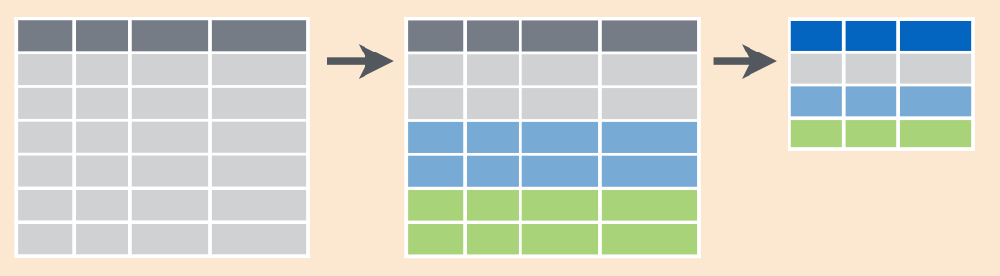
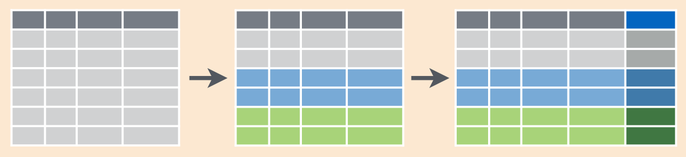

# Введение в R

## Основы
### Типы данных

В R есть несколько типов данных, которые нам будут важны на наших занятиях:

* числа

```{r}
5
8.23
```

* строки

```{r}
"hi"
"тро-ло-ло"
"שלום"
```

Важно отметить, что числа также могут быть строкой: `"5"`.

* логические операторы

```{r}
TRUE
FALSE
```


* пропущенные значения

```{r}
NA
```

Набор значений можно при помощи функции `c()` объединить в единицу, которая называется вектор:

```{r}
c(4, 9)
c("first name", "фамилия")
```

### Переменные

Любое значение можно записать в переменную. Для этого используется оператор присваивания `=`[^1]:

[^1]: Надо сказать, что в R обычно настаивают на использований операторов `<-` и `->`, однако при нашем беглом знакомстве интуитивнее использовать знак равно.

```{r}
x = 2021
x

y = c("имя", "last name")
```

Переменные можно спользовать в манипуляциях:

```{r}
x + 3
```

Однако она останется не изменной, пока мы не сделаем новое присваивание:

```{r}
x
x = x + 3
x
```

### Функции

Любые действия в R происходят при помощи функций:

```{r}
x = c(1, 3, 5, 7)
mean(x)
cumsum(x)
```

```{block, type = "rmdtask"}
Используя функцию `sqrt()` найдите квадратный корень числа 152399025.
```

### Пакеты

Большая часть преимуществ R находится в его пакетах --- наборах функций. Сегодня мы будем использовать пакет `tidyverse`, а завтра пакеты `leaflet` и `leaflet.minicharts`. Первое что имеет смысл сделать, это научиться устанавливать пакеты:

```{r, eval = FALSE}
install.packages(c("tidyverse", "leaflet", "leaflet.minicharts"))
```

R может попросить при первой установке выбрать зеркало -- это не особенно важно, можете выбрать любое. Перед использованием пакета его нужно включить:

```{r}
library(tidyverse)
```

Пакет выдал какое-то сообщение: такое бывает. Главное чтобы не выдал ошибки.

```{block, type = "rmdtask"}
Если Вы еще не скачали пакет, запустите его скачивание и включите библиотеку `tidyverse`.
```

### Как получить помощь?

Во первых легко получить помощь в интернете. Но и в самом R, каждая функция задокументирована, так что можно просто набрать в консоли вопросительный знак и название функции:

```{r, eval=FALSE}
?sqrt()
```

## Введение в `tidyverse`

В R существуют свои поддиалекты: есть базовый R, есть `tidyverse`, есть `data.table`. В этих материалах мы будем работать с `tidyverse`.

### Чтение файлов

Люди придумали достаточно много способов хранить табличные данные (мы будем смотреть только на такие данные). Всем известны таблицы из Excel/LibreOffice/Numbers и самые распространенные форматы `.xls` и `.xlsx`, c которыми можно работать в R при помощи пакетов `readxl` и  `writexl`. На наших занятиях мы рассмотрим более простой формат, с которым предпочитают работать при анализе данных --- `.csv`. Этот формат предполагает использование как машинно-, так и человеко-читаемый формат, в котором значения разделяются некоторым разделителем. Чаще всего в качестве разделителя используют запятую (поэтому `.csv` расшифровывается как *comma separated values*). Важным условием для работы является, чтобы значения в одном столбце были одного типа. Первой строчкой в таком формате данных обычно идет название столбцов. Этот формат можно открыть и редактировать в привычном редакторе однако для пользователей Excel это, к сожалению, требует дополнительных операций, а для пользователей Windows еще и нужно непрырывно следить, чтобы была верная кодировка.


```{r, message = FALSE}
df = read_csv("https://tinyurl.com/yzfgony9")
df
```

В нашем датасете следующие переменные:

* tombstone_code --- код надгробия (`BSH0141`)
* place --- место (`Бешенковичи`)
* tombstone_id --- уникальный номер надгробия (`141`)
* latitude --- широта (`55.0455800198435`)
* longitude --- долгота (`29.4838749171489`)
* last_name --- фамилия (`Фридман`)
* name --- имя (`Ицхак Менаше`)
* fathers_name --- имя отца (`Зув Вольф`)
* gender --- гендерная принадлежность (`m`)
* year --- год смерти (1919)
* tags --- тэги, проставленные разметчиками (`юноша`)
* epitaph_language --- язык эпитафии (`HE`)
* decor_type --- тип декора (`O` --- архитектурно-орнаментальный; `F` --- растительный; `Z` --- зооморфный; `S` --- традиционная символика)
* tombstone_type --- тип памятника (`M` --- стела, `L` --- стела с саркофагом, `P` --- саркофаг/плита, `O` --- охель, `S` --- индивидуальной или сложной формы; `N` --- не определен)
* tombstone_material_code --- материал надгробия (`S` - камень: `SS`-песчаник, `SC` - известняк, `SG` - гранит, `SB` - габбро-диорит, `SL` - лабрадорит, `SM` - мрамор, `AS` - искусственный камень, `M` - металл, `W` - дерево, `O` - другое)

```{block, type = "rmdtask"}
Считайте даные к себе в RStudio. Сколько строчек из датасета напечатались в консоле при вызове переменной с данными?
```

### Манипуляция с данными

При анализе данных часто нужно сделать несколько операций. Рассмотрим пример:

```{r}
x = c(5, 7, 3)

cumsum(x)
cumsum(sort(x))
sort(cumsum(x))
```

Как видно из примера в зависимости от порядка применения функций получается разный результат. Читать длинные цепочки функций не очень удобно, например, при подготовке к нашим занятиям я написал цепочку из 91 операций над датасетом, который мне прислали. В `tidyverse` очень распространено использование так называемого конвеера (*pipe*), который передает результат работы одной функции в другую:

```{r}
x %>% 
  cumsum() %>% 
  sort()

x %>% 
  sort() %>% 
  cumsum() 
```

Для знака конвеера есть своя горячая клавиша: `Ctrl/Cmd+Shift+M`. Конечно, результат можно при желании записать в переменную:

```{r}
x2 = 
  x %>% 
  sort() %>% 
  cumsum()
x2
```

#### `select()`

Теперь мы можем приступить к анализу данных. Начнем с функции `select()`, которая позволяет создать подтаблицу с нужными столбцами, например:

```{r}
df %>% 
  select(tombstone_code, year, gender)
```

#### `arrange()`

Теперь рассмотрим функцию `arrange()`, которая позволяет сортировать один или более столбцов. Например, давайте узнаем гендерную принадлежность усопшего, которого в нашем датасете похоронили раньше всего:

```{r}
df %>% 
  select(tombstone_code, year, gender) %>% 
  arrange(year)
```

```{block, type = "rmdtask"}
Измените предыдущий код, чтобы узнать, где захоронен этот самый ранний усопший?
```

В функции `arrange()` можно использовать сразу несколько переменных.

#### `count()`

Функция `count()` позволяет считать количество наблюдений. Если в скобках не указывать переменных, то функция вернет количество строчек в датасете:

```{r}
df %>% 
  count()
```

Но можно также выбрать какую-то переменную или даже комбинацию переменных:
```{r}
df %>% 
  count(gender)

df %>% 
  count(place, gender)
```

```{block, type = "rmdtask"}
Узнайте в каком из кладбищ больше стел с саркофагом (переменная `tombstone_type` значение `L`).
```

#### `filter()`

Функция `filter()` позволяет отсортировать какие-то значения в переменной:

```{r}
df %>% 
  count(place, gender) %>% 
  filter(gender == "f")
```

Несколько условий можно писать через запятую:

```{r}
df %>% 
  count(place, gender) %>% 
  filter(gender == "f",
         place == "Бешенковичи")
```

Если все условия выше предполагают равенство `==`, то бывает, что нужно отфильтровать ненужное `!=`:

```{r}
df %>% 
  count(place, gender) %>% 
  filter(gender != "n",
         place == "Бешенковичи")
```

#### `mutate()`

Иногда переменных в датасете недостаточно, или имеющиеся нужно изменить, для этого используют функцию `mutate()`. Давайте например, создадим переменную, которая будет содержать возраст надгробий:

```{r}
df %>% 
  mutate(tombstone_age = 2021 - year) %>% 
  select(tombstone_code, year, tombstone_age)
```

В одной функции можно создать и несколько переменных.

#### `group_by() %>% summarise()`

Данная комбинация позволяет создать аналог сводных таблиц в Excel/LibreOffice. Давайте посчитаем средний возраст надгробий в каждом из населенных пунктов:

```{r}
df %>% 
  mutate(tombstone_age = 2021 - year) %>% 
  group_by(place) %>% 
  summarise(mean_age = mean(tombstone_age, na.rm = TRUE))
```

Аргумент `na.rm = TRUE` отвечает за удаление пропущенных значений. Мы могли бы их отфильтровать используя в самом начале команду `filter(is.na(year))`. Сгруппировать можно и по нескольким переменным:

```{r}
df %>% 
  mutate(tombstone_age = 2021 - year) %>% 
  group_by(place, gender) %>% 
  summarise(mean_age = mean(tombstone_age, na.rm = TRUE))
```

Схематично операции, которые происходят в ходе комбинации команд `group_by() %>% summarise()` можно изобразить так:



#### `group_by() %>% mutate()`

Если `group_by() %>% summarise()` создает новую сокращенную табличку, то сочетание команд `group_by() %>% mutate()` позволяет оставлять структуру таблицы нетронутой, что может быть важно, если какие-то из переменных будут потом использоваться.

```{r}
df %>% 
  mutate(tombstone_age = 2021 - year) %>% 
  group_by(place, gender) %>% 
  mutate(mean_age = mean(tombstone_age, na.rm = TRUE)) %>% 
  select(tombstone_code, place, gender, tombstone_age, mean_age)
```

Схематично операции, которые происходят в ходе комбинации команд `group_by() %>% mutate()` можно изобразить так:

